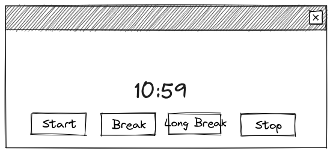
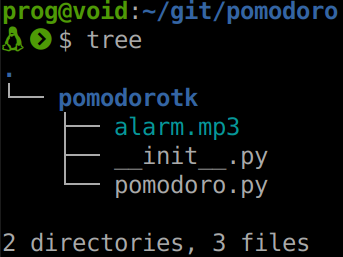
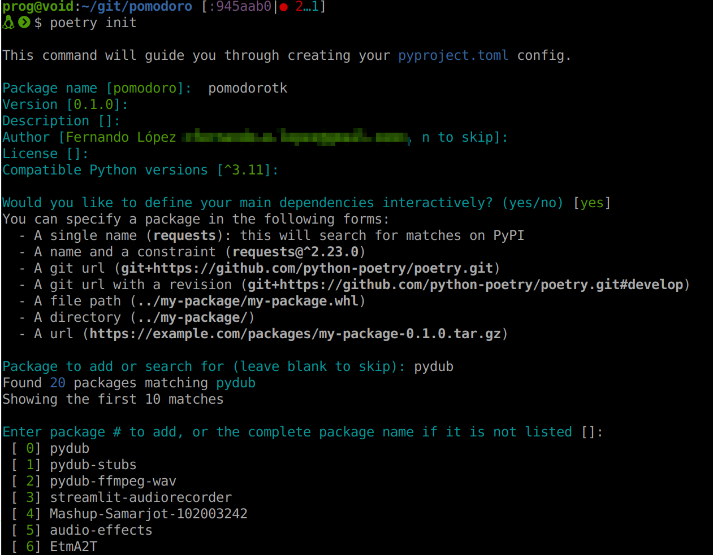
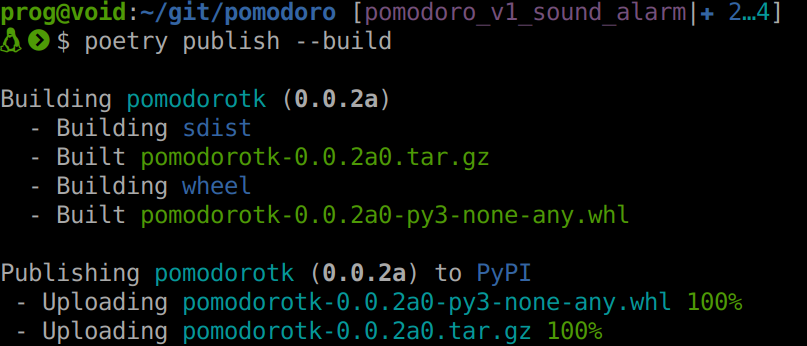

## Proyecto de ejemplo

* Timer para técnica Pomodoro <!-- .element: class="fragment" data-fragment-index="1" -->
* Básicamente una cuenta regresiva <!-- .element: class="fragment" data-fragment-index="2" -->

---

## Prototipo



---

## Modelo

```python
class Timer:
    """
    A timer that can run for a given number of seconds and call a function
    """

    def __init__(self, alarm_fn, update_clock_fn):
        """Initialize the timer"""

    def update(self):
        """Update the timer and call the alarm function if the timer has expired"""

    def start(self, seconds):
        """Start the timer for the given number of seconds"""

    def stop(self):
        """Stop the timer"""
```


Notes: Examples notes

---

## Código de la interfaz gráfica

```python
# Create a window and main frame using ttk themed widgets
root = tk.Tk()
ttk.Style().theme_use("clam")
root.title("Pomodoro Timer")
# ...
# Create a timer object
timer = Timer(lambda: None, update_clock)
# ...
# Run the main loop
tk.mainloop()
```

---

## Demo v0

---

## Nuevos requerimientos

* Queremos una alarma sonora
* La biblioteca de Python no tiene nada que nos ayude
* [PyDub](https://pypi.org/project/pydub/) + [ffmpeg-python](https://pypi.org/project/ffmpeg-python/)

---

## Modificaciones

```diff
+from pydub import AudioSegment, playback
 
 class Timer:
     """
@@ -77,8 +78,15 @@ def update_clock(remainding):
     root.after(UPDATE_TIME_MS, timer.update)
 
 
+alarm_sound = AudioSegment.from_mp3("alarm.mp3")
+
+def alarm():
+    """Play the alarm sound"""
+    playback.play(alarm_sound)
+
+
 # Create a timer object
-timer = Timer(lambda: None, update_clock)
+timer = Timer(alarm, update_clock)
```

---
## ¿Cómo compartimos nuestra app?
 
* Ahora tenemos una dependencia: PyDub y ffmpeg-python <!-- .element: class="fragment" data-fragment-index="1" -->
* Quién quiera usar nuestra app tiene que instalarlas <!-- .element: class="fragment" data-fragment-index="2" -->
* También está el archivo "alarm.mp3" <!-- .element: class="fragment" data-fragment-index="3" -->
* ¿Y nuestra app cómo se instala? <!-- .element: class="fragment" data-fragment-index="4" -->

---

## Qué necesitamos

* Una forma estándar de declarar las dependencias <!-- .element: class="fragment" data-fragment-index="1" -->
* Una forma de compartir nuestra app, por ejemplo en PyPI <!-- .element: class="fragment" data-fragment-index="2" -->
* Alternativas: <!-- .element: class="fragment" data-fragment-index="3" -->
  - setuptools: setup.py + requirements.txt <!-- .element: class="fragment" data-fragment-index="3" -->
  - [Poetry](https://python-poetry.org/): pyproject.toml + poetry.lock <!-- .element: class="fragment" data-fragment-index="3" -->

---


## De script a paquete

* Para distribuirlo es conveniente armar un paquete Python <!-- .element: class="fragment" data-fragment-index="1" -->
* Un paquete Python está compuesto de: <!-- .element: class="fragment" data-fragment-index="2" -->
    - Un directorio <!-- .element: class="fragment" data-fragment-index="3" -->
    - Un archivo "\_\_init\_\_.py" <!-- .element: class="fragment" data-fragment-index="4" -->
    - Módulos (archivos ".py") <!-- .element: class="fragment" data-fragment-index="5" -->
    - Otros recursos (como el "alarm.mp3") <!-- .element: class="fragment" data-fragment-index="6" -->

---



---

## Poetry
### (Porque sí)

```
pipx install poetry # o pip...
```

---



---

## Instalamos dependencias

```
poetry install
```

---

## Ejecutamos nuestro programa

```
poetry run python -m pomodorotk.pomodoro
```

---

## Lo publicamos

1. Creamos una cuenta en PyPI <!-- .element: class="fragment" data-fragment-index="1" -->
2. Solicitamos una API key <!-- .element: class="fragment" data-fragment-index="2" -->
3. Configuramos Poetry: poetry config pypi-token.pypi your-api-token <!-- .element: class="fragment" data-fragment-index="3" -->
4. Finalmente publicamos: poetry publish --build <!-- .element: class="fragment" data-fragment-index="4" -->

---



[pomodorotk](https://pypi.org/project/pomodorotk/)

---

## Demo v1

```
~/git/charla-paquetes/venv-v1
```

---

## ¿Cómo encontrar alarm.mp3?

* importlib puede encontrar archivos contenidos en paquetes Python <!-- .element: class="fragment" data-fragment-index="1" -->
* importlib.resources.files() retorna un objeto que representa al paquete <!-- .element: class="fragment" data-fragment-index="2" -->
* Con ese objeto y el nombre del archivo podemos obtener un objeto que representa al archivo <!-- .element: class="fragment" data-fragment-index="3" -->
* Finalmente importlib.resources.as_file() permite acceder al archivo <!-- .element: class="fragment" data-fragment-index="4" -->

---

```diff
+from importlib import resources
...
+mp3resource = resources.files("pomodorotk").joinpath("alarm.mp3")
+with resources.as_file(mp3resource) as mp3file:
+    alarm_sound = AudioSegment.from_mp3(mp3file)
```

---

## Demo v2

```
~/git/charla-paquetes/venv-v2
```

---

## ¿Cómo ejecutarlo sin `python -m`?

* Necesitamos crear un script
* Definimos el script en pyproject.toml
```toml
[tool.poetry.scripts]
pomodoro = "pomodorotk.pomodoro:main"
```
* Movemos el código que estaba suelto a una función main
* Podemos probar con `poetry run pomodoro`

---

## Demo v3

```
~/git/charla-paquetes/venv-v3
```

---

## ¿Se puede distribuir una app en un archivo?

* Sí <!-- .element: class="fragment" data-fragment-index="1" -->
* Como siempre hay varias alternativas como: <!-- .element: class="fragment" data-fragment-index="2" -->
  - pyinstaller <!-- .element: class="fragment" data-fragment-index="2" -->
  - zipapp <!-- .element: class="fragment" data-fragment-index="2" -->

---

## zipapp

* Incluido en Python <!-- .element: class="fragment" data-fragment-index="1" -->
* Genera un zip con los módulos  <!-- .element: class="fragment" data-fragment-index="2" -->
* Necesita que el intérprete esté instalado para funcionar  <!-- .element: class="fragment" data-fragment-index="3" -->

---

## \_\_main\_\_.py

* A la misma altura de `pomodorotk` debemos crear `__main__.py`

```
from pomodorotk.pomodoro import main

if __name__ == "__main__":
    main()
```

---

```
# Instalamos las dependencias en la carpeta del proyecto para incluirlas en la zipapp
poetry export -f requirements.txt --output requirements.txt
pip install -r requirements.txt --target .

# Vamos al directorio que contiene el proyecto
cd ..

# Generamos la zipapp
python -m zipapp pomodoro

# La podemos ejecutar con
python pomodoro.pyz
```

---

## Repaso

* Un módulo es un `.py`
* Un paquete es una carpeta con un `__init__.py` adentro
* Poetry permite crear un paquete instalable con pip de forma conveniente
* zipapp permite distribuir un proyecto de forma cómoda (siempre que se tenga Python instalado)
* Yapa: `__main__.py` permite que un directorio sea ejecutable

---

<!-- .slide: data-background="#81ceff" -->
## FIN

* ¿Preguntas?


github

